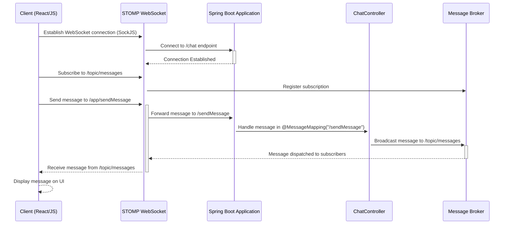

## Websockets Chat




# console

```bash
Opening Web Socket...
stomp.min.js:8 Web Socket Opened...
stomp.min.js:8 >>> CONNECT
accept-version:1.1,1.0
heart-beat:10000,10000


stomp.min.js:8 <<< CONNECTED
version:1.1
heart-beat:0,0


stomp.min.js:8 connected to server undefined
stomp.min.js:8 >>> SUBSCRIBE
id:sub-0
destination:/topic/messages


stomp.min.js:8 >>> SEND
destination:/app/sendMessage
content-length:35

{"sender":"User","content":"hello"}
stomp.min.js:8 <<< MESSAGE
destination:/topic/messages
content-type:application/json
subscription:sub-0
message-id:dvqspa0k-0
content-length:35

{"sender":"User","content":"hello"}
stomp.min.js:8 <<< MESSAGE
destination:/topic/messages
content-type:application/json
subscription:sub-0
message-id:dvqspa0k-2
content-length:45

{"sender":"User","content":"hi from cognito"}
```


This test is quite interesting for concurrency:
```java

public class ProposalServiceTest {

    private ProposalService proposalService;

    @BeforeEach
    public void setUp() {
        proposalService = new ProposalService();
        proposalService.addProposal(new Proposal("User 1", "Proposal 1"));
    }

    @RepeatedTest(1000)
    public void testConcurrentVoting() throws InterruptedException {
        // Get the proposal to test
        Proposal proposal = proposalService.proposals().get(0);

        // Increase the number of threads to create higher contention
        ExecutorService executorService = Executors.newFixedThreadPool(100);

        // Simulate a high number of concurrent votes
        int numberOfVotes = 1000;
        Vote vote = new Vote();
        vote.setProposalId(proposal.getId());
        for (int i = 0; i < numberOfVotes; i++) {
            executorService.submit(() -> proposalService.addVote(vote));
        }

        // Shutdown the executor and wait for all tasks to complete
        executorService.shutdown();
        executorService.awaitTermination(10, TimeUnit.SECONDS);

        // Assert that the vote count matches the number of submitted votes
        assertEquals(numberOfVotes, proposal.getVoteCount(),
                "Votes should be " + numberOfVotes + " after concurrent voting");
    }
}
```

We can then change the Proposal class voteCount to int to make the test fail. 
Another way to make the test pass would be to use synchronised keyword on ProposalService addVote.
The project as a whole is a relatively interesting exploration of websockets, server client interaction
and concurrency.

### Example Race Condition:
```bash

12:03:46.074 [pool-1-thread-18] INFO com.example.demo.Proposal -- Before count: 33 After count: 34
12:03:46.075 [pool-1-thread-56] INFO com.example.demo.Proposal -- Before count: 51 After count: 52
12:03:46.075 [pool-1-thread-69] INFO com.example.demo.Proposal -- Before count: 18 After count: 19
12:03:46.076 [pool-1-thread-73] INFO com.example.demo.Proposal -- Before count: 47 After count: 48
12:03:46.075 [pool-1-thread-54] INFO com.example.demo.Proposal -- Before count: 35 After count: 36
12:03:46.136 [pool-1-thread-86] INFO com.example.demo.Proposal -- Before count: 33 After count: 34
```

The Race condition means that the concurrency test fails with:
```bash

org.opentest4j.AssertionFailedError: Votes should be 1000 after concurrent voting ==> 
Expected :1000
Actual   :999
<Click to see difference>


	at org.junit.jupiter.api.AssertionFailureBuilder.build(AssertionFailureBuilder.java:151)
	at org.junit.jupiter.api.AssertionFailureBuilder.buildAndThrow(AssertionFailureBuilder.java:132)
	at org.junit.jupiter.api.AssertEquals.failNotEqual(AssertEquals.java:197)
	at org.junit.jupiter.api.AssertEquals.assertEquals(AssertEquals.java:150)
	at org.junit.jupiter.api.Assertions.assertEquals(Assertions.java:563)
	at com.example.demo.ProposalServiceTest.testConcurrentVoting(ProposalServiceTest.java:44)
	at java.base/java.lang.reflect.Method.invoke(Method.java:580)
	at java.base/java.util.ArrayList.forEach(ArrayList.java:1596)
	at java.base/java.util.ArrayList.forEach(ArrayList.java:1596)


```
We save the output of the test to /Users/tspencer/Desktop/demo/spring-websockets-test.log using intellij config for the test.
We can then use RaceConditionDetector to find the example Race Condition.

This is the output of the RaceConditionDetector to find the line which had the race condition:
```bash
Race Conditions Detected: 1
Race Condition for After count: 34
12:03:46.074 [pool-1-thread-18] INFO com.example.demo.Proposal -- Before count: 33 After count: 34
12:03:46.136 [pool-1-thread-86] INFO com.example.demo.Proposal -- Before count: 33 After count: 34
```
