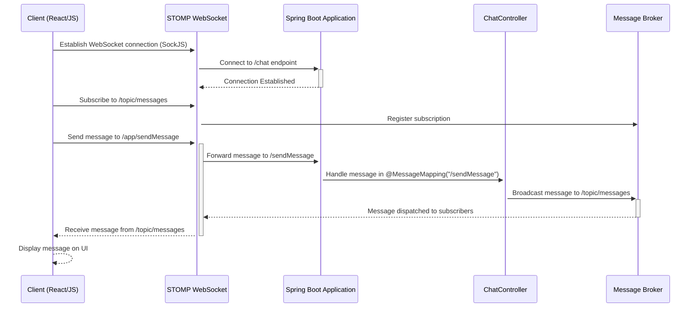

## Websockets Chat

```mermaid
sequenceDiagram
participant Client as Client (React/JS)
participant WebSocket as STOMP WebSocket
participant Server as Spring Boot Application
participant Controller as ChatController
participant Broker as Message Broker

    Client->>+WebSocket: Establish WebSocket connection (SockJS)
    WebSocket->>+Server: Connect to /chat endpoint
    Server-->>-WebSocket: Connection Established
    
    Client->>+WebSocket: Subscribe to /topic/messages
    WebSocket->>Broker: Register subscription

    Client->>+WebSocket: Send message to /app/sendMessage
    WebSocket->>+Server: Forward message to /sendMessage
    Server->>+Controller: Handle message in @MessageMapping("/sendMessage")
    
    Controller->>+Broker: Broadcast message to /topic/messages
    Broker-->>-WebSocket: Message dispatched to subscribers

    WebSocket-->>-Client: Receive message from /topic/messages
    Client-->>Client: Display message on UI

```

# websockets
